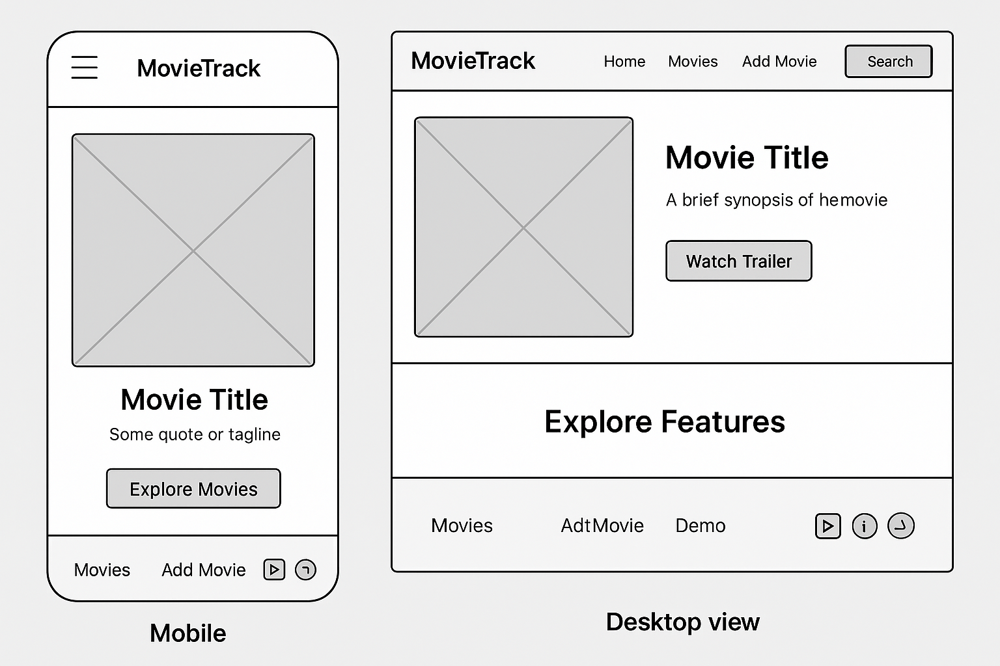

## MovieTrack Site Plan

### Site Name: MovieTrack – Track what you’ve watched. Discover what’s next.

**Rationale:** The name "MovieTrack" clearly communicates the primary function of the web application: tracking movies. The tagline "Track what you’ve watched. Discover what’s next." further clarifies its purpose, highlighting both organizational and discovery aspects for users. It's concise, memorable, and directly relevant to the content.

---

### Purpose of the Site

The purpose of MovieTrack is to provide users with a personalized and intuitive platform to manage their movie consumption. It aims to:
* Allow users to easily browse and discover new movies.
* Enable users to track movies they have watched or wish to watch.
* Provide tools for organizing movie lists (e.g., watched, favorites, watchlist).
* Offer an interactive experience with dynamic content and user-specific data storage.
* Serve as a practical application of HTML, CSS, and JavaScript skills, demonstrating dynamic content rendering, data fetching, and client-side storage.

---

### Scenario Questions

To understand the user experience and ensure the site meets its objectives, here are some scenario questions from the perspective of a target audience member:

1.  "I just finished watching a movie and want to add it to my 'watched' list. How quickly can I find it and mark it as watched?"
2.  "I'm looking for a new movie to watch. Can I filter movies by genre (e.g., 'Sci-Fi') or by a high rating to find something good?"
3.  "I remember seeing a movie on the site earlier but can't recall its name. Can I search for it, and then view its details in a pop-up?"
4.  "I want to make sure my watchlist is saved even if I close my browser. Will the site remember my 'favorite' movies or my 'watched' status?"
5.  "I want to suggest a movie that isn't on the site yet. Is there an easy way to submit new movie information?"

---

### Color Schema

The color schema for MovieTrack will be inspired by the sophisticated and engaging aesthetics of popular streaming services like Netflix and Amazon Prime Video. The aim is to create a modern, sleek, and immersive experience that keeps the focus on movie content while providing a visually appealing interface.

* **Primary Background:** **Deep Charcoal** (`#141414`) - A dark, almost black, background reminiscent of a cinematic environment, perfect for making vibrant content pop.
* **Secondary Background:** **Slightly Lighter Charcoal** (`#202020`) - Used for subtle differentiation of sections or components, maintaining a dark theme.
* **Accent Color (Interactive Elements/Highlights):** **Vibrant Red** (`#E50914`) - A bold and energetic red, similar to Netflix's branding, used for call-to-action buttons, active selections, and key highlights.
* **Text Color (Main):** **Soft White** (`#F5F5F1`) - A slightly off-white for primary text, ensuring excellent readability against the dark background without being overly stark.
* **Secondary Text/Subtle Elements:** **Medium Gray** (`#808080`) - A neutral gray for less prominent text, subtitles, or inactive elements, providing subtle visual hierarchy.
* **Success/Confirmation:** **Forest Green** (`#28A745`) - A clear, reassuring green for success messages, confirmations, or positive indicators, offering a strong contrast to the darker palette.
---

### Typography

The typography will focus on readability and a modern feel, using a combination of a clean sans-serif for body text and a slightly more distinct sans-serif for headings.

* **Headings (H1, H2, H3):** **'Montserrat'** (sans-serif) - Bold and modern, suitable for titles and section headers.
    * Example: **MovieTrack**
    * Example: **Browse Movies**
* **Body Text (Paragraphs, List Items, Labels):** **'Open Sans'** (sans-serif) - Highly readable and versatile, ideal for all general content.
    * Example: Track what you’ve watched. Discover what’s next.
    * Example: This movie is a classic sci-fi adventure.

---

### Home Wireframe
